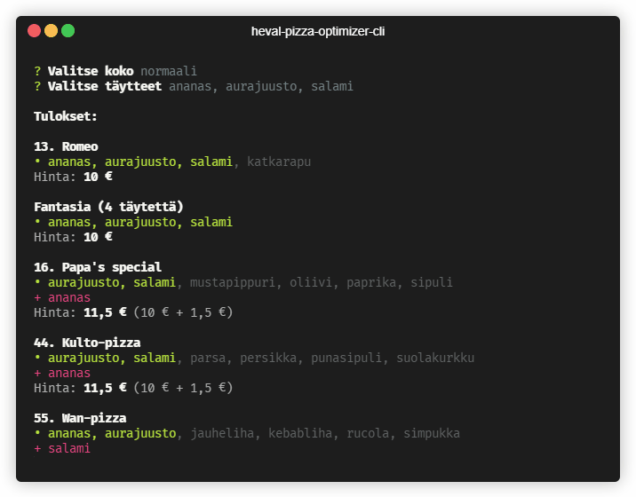

# heval-pizza-optimizer-cli

CLI tool for optimizing pizza orders at Heval restaurant in Hervanta, Tampere. Scrapes the pizza menu from http://www.heval.fi and then given the desired pizza size and toppings computes the optimal pizza order, prioritizing price and any extra toppings. :floppy_disk: :pizza: :moneybag: :chart_with_downwards_trend:




## Installation

```sh
git clone git@github.com:penny-five/heval-pizza-optimizer-cli.git
cd heval-pizza-optimizer-cli
yarn install
yarn start
```

## License

MIT.

## Credits

Screen capture made with [Terminalizer](https://github.com/faressoft/terminalizer).
